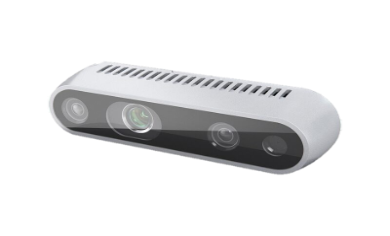
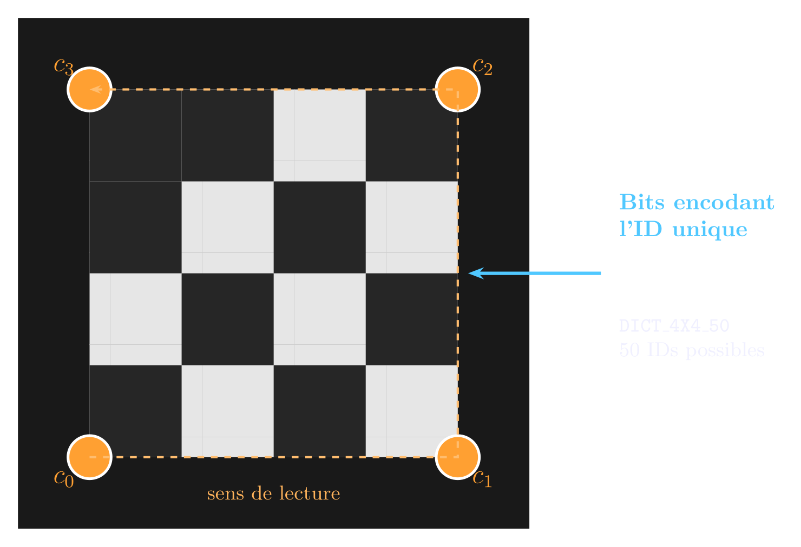
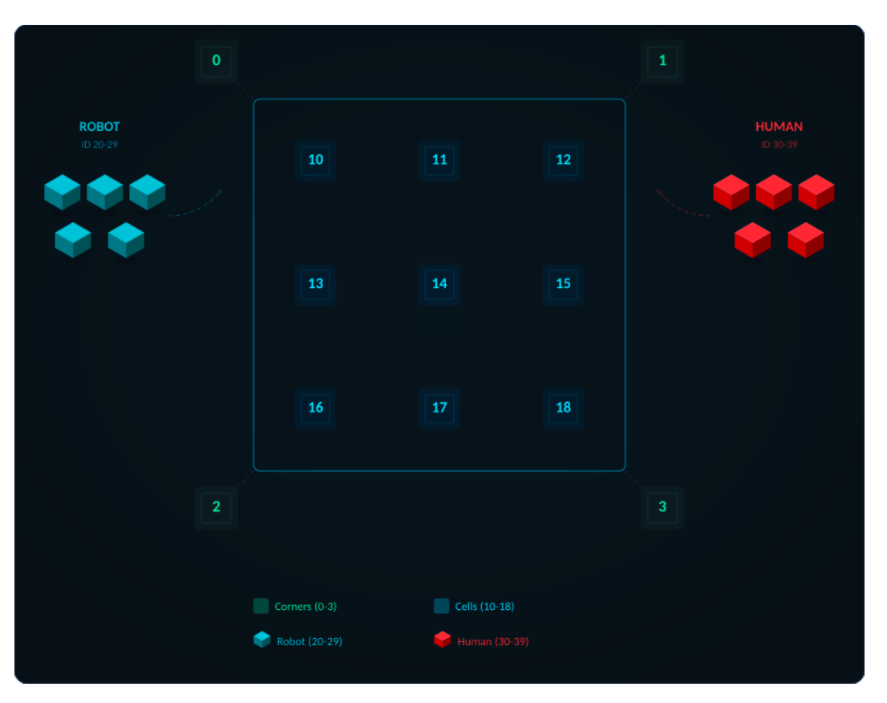
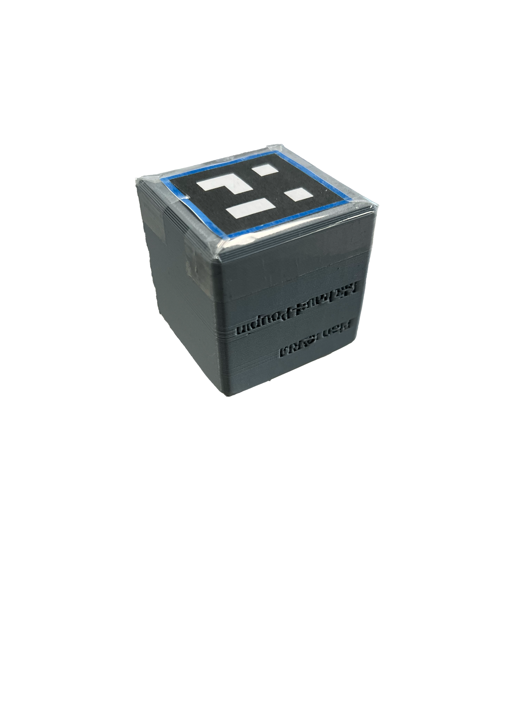
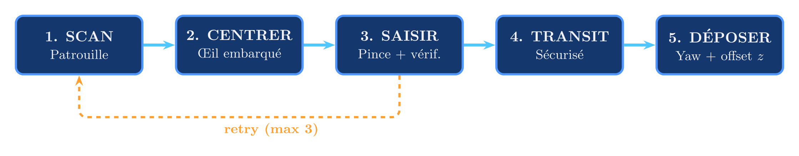
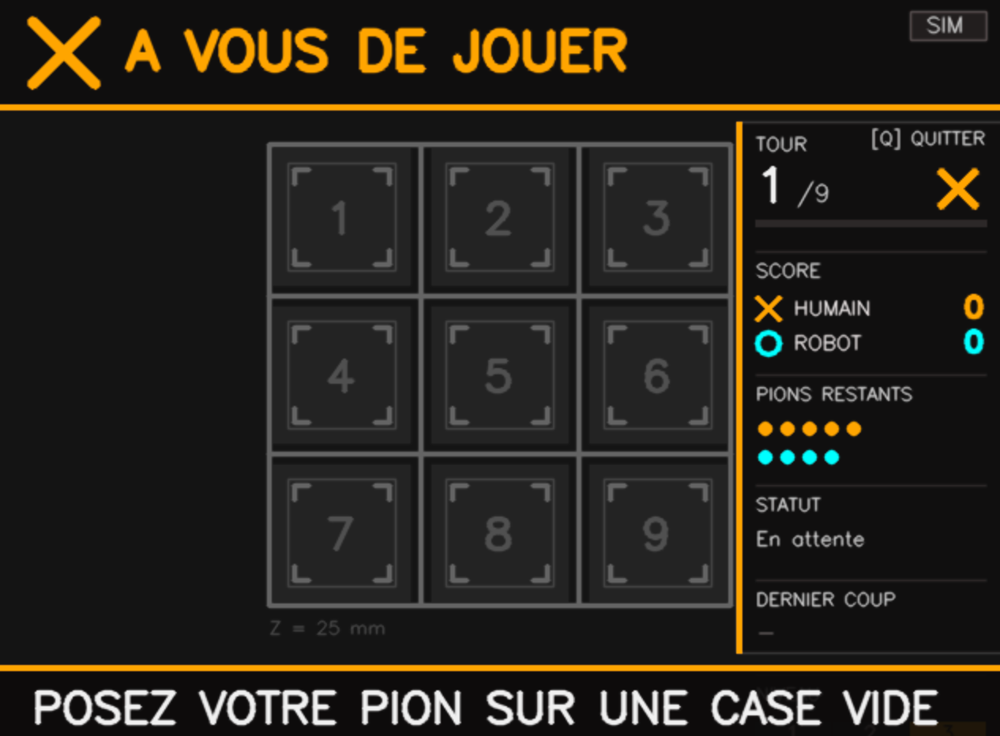
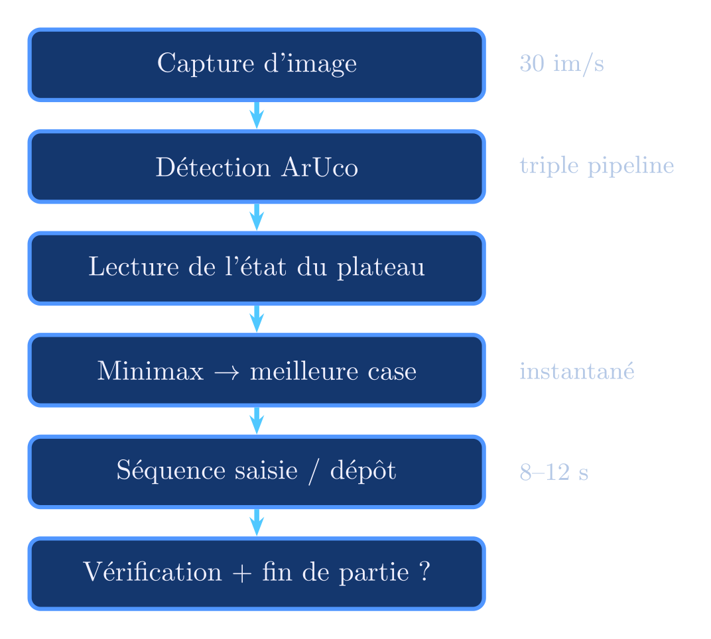

# xArm6 Autonomous Tic-Tac-Toe

**A UFactory xArm6 robotic arm playing tic-tac-toe against a human, guided by an Intel RealSense D435 depth camera and ArUco fiducial markers.**

Matthieu POUPIN & Lou-Ann MICHAUD, ENSEIRB-MATMECA, Electronics Engineering, 2025–2026  
Supervisors: M. Pierre Melchior & M. Matthieu Chevrié, EEL8-PROJ1 [BRA]

<p align="center">
  
</p>

---

## Overview

The robot detects the board state in real time via ArUco markers, computes the best move with a Minimax alpha-beta algorithm, picks a pawn from its stock, and places it precisely on the target cell, entirely without human intervention once the game starts.

Built as an attractive demonstration for ENSEIRB-MATMECA open days. ~2 700 lines of Python, single-file architecture (easier to hand-over and to compile for new users)

- **Vision**: Intel RealSense D435, ArUco markers (DICT_4X4_50), triple detection pipeline
- **Game Algorithm**: 3 difficulty levels including unbeatable Minimax alpha-beta
- **Control**: xArm Python SDK over Ethernet TCP/IP, eye-in-hand camera configuration
- **HUD**: real-time OpenCV overlay showing board state, scores, status
- **Simulation mode**: fully playable without hardware (mouse clicks replace physical pawns)

---

## Hardware

| Component | Role |
|-----------|------|
| UFactory xArm6 | 6-DOF robotic arm, 700 mm reach, ±0.1 mm repeatability, TCP/IP control |
| xArm Gripper | End-effector, 86 mm opening |
| Intel RealSense D435 | RGB 640×480 @ 30 fps + depth, mounted on the wrist (eye-in-hand) |
| Laser-engraved wood board | CTP 29.7×42 cm (A3), 3×3 grid with ArUco markers on each cell and corner |
| 3D-printed PLA pawns | 50 mm cubes, unique ArUco marker glued on top face (print sheets in `cad/`) |

<p align="center">
  
  <br><em>Intel RealSense D435: RGB + depth camera, mounted eye-in-hand on the wrist</em>
</p>

### ArUco addressing plan (DICT_4X4_50)

| ID range | Role |
|----------|------|
| 0–3 | Board corners (calibration) |
| 10–18 | Game cells |
| 20–29 | Robot pawns (blue, symbol O) |
| 30–39 | Human pawns (red, symbol X) |

<p align="center">
  
  <br><em>ArUco ID layout: corners, cells, robot and human pawns</em>
</p>

<p align="center">
  
  <br><em>Complete layout: ArUco IDs, board corners, robot stock (blue, IDs 20–29) and human stock (red, IDs 30–39)</em>
</p>

<p align="center">
  
  <br><em>Laser-engraved board with 3D-printed pawns</em>
</p>

<p align="center">
  
  <br><em>Robot pawn (blue border) vs human pawn (red border)</em>
</p>

---

## Software Architecture

The entire program runs as a single Python file (`morpion.py`), structured in 5 logical sections:

| Section | Class / Module | Role |
|---------|---------------|------|
| 0 | `ConfigManager` | JSON config externalization (`config_robot.json`) |
| 1 | `MorpionIA` | AI: 3 difficulty levels including Minimax alpha-beta |
| 2 | `RobotController` | ~900 lines, all high-level robot movements |
| 3 | `dessiner_*` | HUD overlay on live camera feed (OpenCV) |
| 4 | `VisionSystem` | Video acquisition + triple ArUco detection pipeline |
| 5 | `main()` | Main game loop + calibration assistant |

### Game Algorithm: 3 difficulty levels

- **EASY**: 70% random moves, opportunistic win if available
- **MEDIUM**: heuristic rules (win > block > center > corner > random)
- **HARD**: Minimax with alpha-beta pruning: unbeatable, strategic move ordering `[4,0,2,6,8,1,3,5,7]`

### Vision: triple detection pipeline

Each frame attempts ArUco detection in 3 successive passes:
1. Gamma correction + CLAHE (adaptive contrast)
2. Raw color image
3. Sharpness filter (reinforced Laplacian kernel) + grayscale

Detection stops as soon as one pass succeeds. Achieves >99% detection rate even for dense markers (ArUco ID 0).

### Robot move sequence

<p align="center">
  
  <br><em>Scan → Center → Pick → Transit → Place</em>
</p>

1. Compute best move via `meilleur_coup()`
2. Move above stock, identify an available pawn
3. Iterative fine-centering (camera centered on pawn marker)
4. Descend to `z_game - 10 mm`, close gripper, verify grip
5. Move above target cell, fine-center on cell ArUco
6. Place pawn, rise, record move

Up to 3 retries on grip failure before aborting.

### HUD

<p align="center">
  
  <br><em>HUD overlay: board state, scores, remaining pawns, status</em>
</p>

<p align="center">
  
</p>

---

## Quickstart

### Requirements

- Python ≥ 3.9
- Linux or Windows PC (macOS: simulation mode only as `pyrealsense2` is not officially supported)
- Packages: `opencv-python`, `numpy`, `pyrealsense2`, `xarm-python-sdk`

```bash
pip install opencv-python numpy
pip install pyrealsense2         # Linux/Windows only
pip install xarm-python-sdk
```

### Running

```bash
python3 morpion.py
```

On first run (no `config_robot.json`), the calibration assistant launches automatically. Choose difficulty when prompted: `1` = Easy, `2` = Medium, `3` = Hard.

**Simulation mode** activates automatically if `pyrealsense2` or the xArm SDK is unavailable. Board cells then become clickable.

### Calibration (first run only, ~2 minutes)

The `wizard_calibration` function guides you through 3 steps:

1. Vision tuning (gamma, CLAHE)
2. Record SCAN position (global board view) and STOCK position
3. Automatic calibration: robot moves above ArUco corner 0, you lower the gripper to contact. The program derives board height Z and residual mechanical bias XY

Settings are saved to `config_robot.json` and persist across sessions.

### Network setup

The xArm6 IP is fixed at `192.168.1.208`. Set your PC's Ethernet interface to static IP on `192.168.1.0/24` (e.g. `192.168.1.100`).

---

## Configuration

All geometric parameters live in `config_robot.json` (auto-generated on first calibration). Key fields:

| Field | Description |
|-------|-------------|
| `offset_cam` | `[dx, dy, dz]` mm vector from robot TCP to camera optical center |
| `correction_mecanique_xy` | Residual mechanical bias in mm, corrects systematic placement drift |
| `pos_scan` | `[X, Y, Z, roll, pitch, yaw]`: global board overview position |
| `pos_stock` | Stock position where robot pawns are stored |
| `z_jeu` | Board surface height in mm |

> `config_robot.json` is excluded from git (`.gitignore`). Each physical setup requires its own calibration.

---

## Challenges & Solutions

| Problem | Solution |
|---------|----------|
| ArUco 0 detection failures (~1/5 frames) on dark background | Added 3rd pipeline level: Laplacian sharpness filter → >99% detection rate |
| Systematic ~15 mm Y placement drift | `correction_mecanique_xy` field in JSON, measured in-situ during calibration |
| OpenCV window freezing during arm movements | Non-blocking moves (`wait=False`) + `arm.get_state()` polling loop |
| Double human move validation (pawn moving over board) | 30-frame consecutive detection threshold + 80 px proximity criterion |
| `pyrealsense2` incompatible with macOS | Full simulation mode: imports in `try/except`, boolean flags, black 640×480 fallback |
| Spectator moving a pawn out of turn | Frame-by-frame comparison of logical vs. physical board state, HUD red alert |

---

## Results

- Full game (9 moves): **1–2 minutes**
- HARD mode: **never lost** in testing (Minimax optimal)
- Calibration: **~2 minutes**, persistent across games
- Simulation mode: fully functional for demonstrations without hardware

---

## Future Work

The project is done on our part, but for future students who wish to continue it:

- **Board homography** using corner markers (IDs 0–3) via `cv2.findHomography`. It would eliminate SCAN position calibration
- **Robot vs. robot**: two `RobotController` instances alternating. Architecture already supports it, but you would have to verifiy if the other available robot in the lab is python-compliant.
- **Object classification** (MobileNet / YOLO) to replace ArUco markers.
- **Force control**: collision detection and mass-based pawn sorting

---

## Repository Structure

```
xarm6-morpion/
├── morpion.py          # Main program (~2 700 lines)
├── config_robot.json   # Calibration config (not committed)
├── assets/             # Photos, diagrams, HUD screenshots
├── cad/                # Board SVG + pawn STEP file + ArUco print sheets
│   ├── Plateau_morpion_2.svg
│   ├── Morion_pawn.step
│   ├── aruco_page_bleue.png   # Robot pawns (IDs 20–29, blue border)
│   └── aruco_page_rouge.png   # Human pawns (IDs 30–39, red border)
└── docs/               # Project report (PDF) + presentation (PPTX)
```

---

## For Future Students

This project is handed off as-is at the end of the 2025–2026 academic year. The code is functional and the robot has been demonstrated successfully. Here is what you need to know to pick it up:

**What works reliably**
- Full game loop (scan → pick → place → win detection) in normal lighting conditions
- Simulation mode on any laptop without hardware
- Calibration wizard: takes ~2 minutes on first run, then persists across sessions
- HARD mode is genuinely unbeatable (Minimax optimal)

**What still needs work**
- ArUco detection is sensitive to ambient light and marker angle: if detection rate drops, adjust gamma and CLAHE values in `config_robot.json`
- The `correction_mecanique_xy` field must be re-measured on each physical setup; do not reuse another team's calibration
- Human move validation (30-frame threshold) can feel sluggish, tunable in `VisionSystem`

**Suggested next steps** (see [Future Work](#future-work) for detail)
1. Board homography via corner markers (would eliminate the SCAN calibration step entirely)
2. Replace ArUco with a neural classifier (MobileNet/YOLO), more robust to occlusion and lighting
3. Robot vs. robot mode: the `RobotController` architecture already supports two instances

**To get started**
```bash
python3 morpion.py          # launches calibration wizard on first run
python3 morpion.py          # simulation mode if no hardware detected
```

Contact your supervisors (M. Pierre Melchior, M. Matthieu Chevrié) for access to the xArm6 and camera hardware.

---

## Acknowledgements

Thanks to **M. Pierre Melchior** and **M. Matthieu Chevrié** for their guidance throughout the project.  
Thanks to the ENSEIRB-MATMECA and EIRLAB technical staff for access to the xArm6, 3D printer, and laser engraver.  
Thanks to previous cohorts whose reports on the xArm6 and RealSense D435 provided the starting point for this work.

---

## Dependencies

- [xArm Python SDK](https://github.com/xArm-Developer/xArm-Python-SDK)
- [Intel RealSense SDK 2.0 (librealsense)](https://github.com/IntelRealSense/librealsense)
- [OpenCV: ArUco Detection](https://docs.opencv.org/4.x/d5/dae/tutorial_aruco_detection.html)

---

*Matthieu POUPIN & Lou-Ann MICHAUD, ENSEIRB-MATMECA, Bordeaux INP, 2025–2026*
